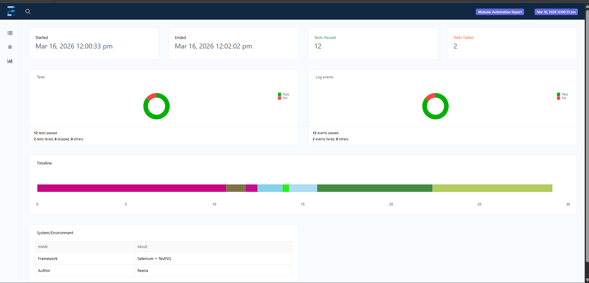
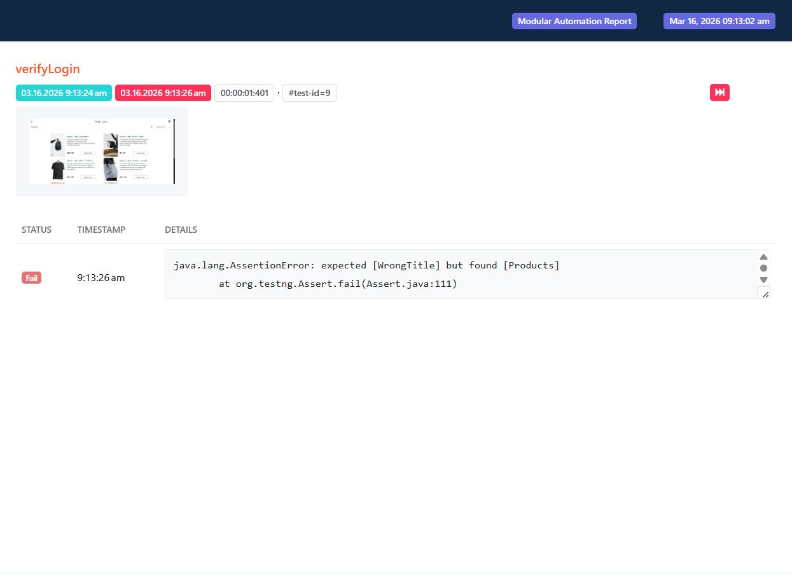
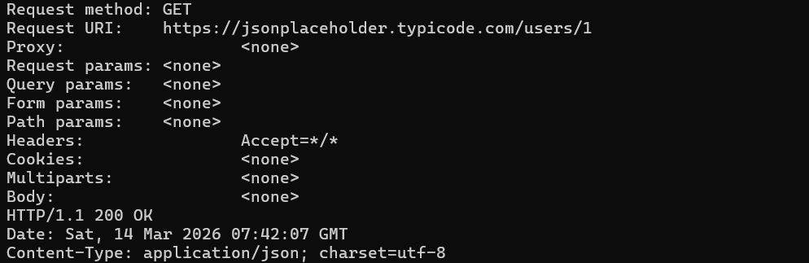

# Selenium Automation Framework (UI + API Testing) using Java, TestNG, and REST Assured


---

# Project Overview

This is a **Hybrid Automation Framework** designed for scalable UI and API testing using Java, Selenium, TestNG, and RestAssured.

### Core Architecture:

* **Modular Design:** Implements Page Object Model (POM) to separate test logic from UI elements.
* **Separation of Concerns:** Clear separation between page objects, test classes, utilities and API layer.
* **Hybrid Testing:** Supports both UI automation (Selenium) and API testing (RestAssured) in a single framework.
* **Reusable & Scalable:** Designed for maintainability, reusability and easy extension.
* **Smart Reporting:** Uses TestNG listeners and Extent Reports for logging, reporting, and screenshots.

This framework demonstrates industry-standard automation practices such as modular design, data-driven testing, cross-browser execution and integrated reporting.

---

# Why Automation Testing?

Automation testing helps improve **software quality and development speed** by:

* Reducing manual testing effort
* Running regression tests quickly
* Ensuring repeatable and reliable test execution
* Supporting continuous integration and delivery

This framework demonstrates how **UI automation and API testing can be integrated into a single scalable automation project**.

---

# Tech Stack

| Technology             | Purpose                         |
| ---------------------- | ------------------------------- |
| **Java 21**            | Programming language            |
| **Selenium WebDriver** | Web UI automation               |
| **TestNG**             | Test framework                  |
| **Maven**              | Build and dependency management |
| **RestAssured**        | API automation testing          |
| **Extent Reports**     | HTML test reporting             |
| **Log4j2 / SLF4J**     | Logging                         |
| **WebDriverManager**   | Automatic driver management     |

---

#  Framework Features

### Page Object Model (POM)

* Separates page elements and test logic
* Improves maintainability and readability

### Cross Browser Testing

Supports execution on:

* Chrome
* Edge
* Firefox

### Configurable Environment

Framework configuration is controlled using:

```id="c6c8dt"
config.properties
```

Example configuration:

```id="5p2m79"
browser=chrome
baseUrl=https://example.com
```

### Screenshot on Failure

Automatically captures screenshots when test cases fail.

### Extent HTML Reporting

Generates interactive HTML reports containing:

* Test execution details
* Logs
* Screenshots

### Data Driven Testing

Uses **TestNG DataProvider** to execute tests with multiple test data sets.

### API Automation

Uses **RestAssured** to validate APIs including:

* GET requests
* POST requests
* Status code validation
* Negative scenarios

---

# Project Structure

```id="3w3c5y"
modular-automation-framework
│
├── images
├── logs
├── reports
├── screenshots
│
├── src
│   ├── main
│   │   ├── java
│   │   │   └── com
│   │   │       └── qaautomation
│   │   │           ├── constants
│   │   │           ├── pages
│   │   │           └── utils
│   │   │
│   │   └── resources
│   │
│   └── test
│       ├── java
│       │   └── com
│       │       └── qaautomation
│       │           ├── api
│       │           │   └── base
│       │           ├── base
│       │           ├── listeners
│       │           └── tests
│       │
│       └── resources
│
├── pom.xml
├── README.md
└── testng.xml
```
The framework follows Page Object Model (POM) architecture where:

- pages → UI page classes
- tests → Test scenarios
- utils → reusable helper methods
- listeners → TestNG listeners for reporting
- api → API automation using RestAssured
---

# Setup / Installation

### Prerequisites

Install the following tools before running the project:

* **Java 21**
* **Maven**
* **Chrome / Edge / Firefox**
* **IntelliJ IDEA or Eclipse**

---

### Clone the Repository

```id="1n9qlp"
git clone https://github.com/Reena-Rajappa/selenium-modular-automation-framework.git
```

Navigate to the project folder:

```id="9m2l1j"
cd selenium-modular-automation-framework
```

Install dependencies:

```id="nht97j"
mvn clean install
```

---

#  Running Tests

### Run All Tests

```id="1b24nl"
mvn test
```

### Run Specific Test Class

```id="lym7c7"
mvn -Dtest=LoginTest test
```

### Run TestNG Suite

```id="81hgca"
mvn test -DsuiteXmlFile=testng.xml
```

You can also run tests directly from **IntelliJ by executing the TestNG XML file**.

---

# Test Coverage

## UI Test Scenarios

### Login Module

* Login with valid credentials
* Login with invalid credentials
* Locked user validation
* Login with performance glitch user (slow response validation)

### Error Handling

* Invalid username/password message validation
* User lock validation

---

## API Test Scenarios

### User API

* GET user details
* Invalid user validation
* POST request validation
* Status code verification

---

# Reports

After test execution, reports are generated automatically.

### Extent Report

Location:

```id="md00sn"
reports/ExtentReport.html
```

### Screenshots

Location:

```id="z0jtb1"
screenshots/
```

Failed test screenshots are automatically attached to the report.

A sample failure test is included to demonstrate screenshot capture and reporting functionality.

---
## Test Execution Outputs

### Test Report



### Failed Test Screenshot Capture



### API Test Execution



---
# Future Improvements

Possible enhancements for the framework:

* CI/CD integration (GitHub Actions / Jenkins)
* Parallel test execution
* Docker support for test environments
* Integration with Allure Report for advanced reporting and CI/CD compatibility
* Test data management using external files

---

# Author

**Reena R**

Java Developer transitioning to Test Automation Engineer / SDET

Skills:
Java | Selenium | TestNG | API Testing | Maven | Automation Framework Design

GitHub: https://github.com/Reena-Rajappa


---


